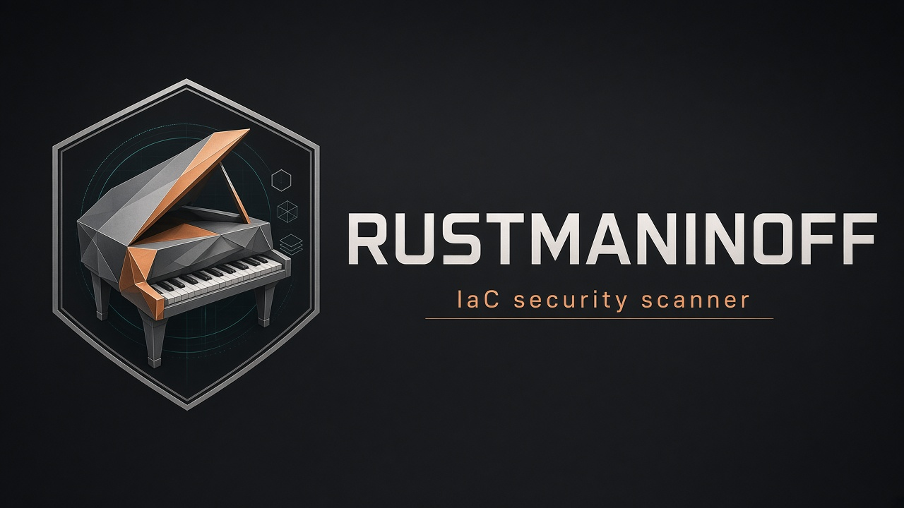

# Rustmaninoff

<p align="center">
  
</p>

Attribute scanner for Terraform, CloudFormation, and Kubernetes. Policies are Checkov-compatible YAML and reuse published CKV ids. The engine is not a port of the Checkov Python runtime.

Built-in policies are rewritten YAML, attributed to [Checkov](https://github.com/bridgecrewio/checkov) (Bridgecrew / Palo Alto Networks, Apache-2.0).

## Build

Requires Rust 1.95 or newer.

```sh
cargo build --release -p rustmaninoff
./target/release/rustmaninoff scan .
```

## Scan

```sh
rustmaninoff scan [PATH] \
  --framework terraform,cloudformation,kubernetes \
  --check CKV_AWS_3 \
  --skip-check CKV_AWS_8 \
  --output cli,json,sarif,junit \
  --fail-on HIGH \
  --external-checks-dir ./extra
```

Exit codes: `0` when nothing fails the threshold, `1` when a finding is at or above `--fail-on` (default `HIGH`) or a file fails to parse, `2` on usage errors. `--soft-fail` always exits `0`.

Interpolations (`${...}`, `Fn::*`, `!Ref`, `!GetAtt`) are unknown. Unknown results do not fail the process. Pass `--show-unknown` to print them.

Inline skip: `# checkov:skip=CKV_AWS_3:reason`. Kubernetes annotation value: `checkov.io/skip: CKV_K8S_16=reason`.

Optional `.rustmaninoff.yaml`:

```yaml
frameworks: [terraform, cloudformation, kubernetes]
skip_checks: []
fail_on: HIGH
excluded_paths: []
external_checks_dirs: []
show_unknown: false
compact: false
```

Directories named `.git`, `.terraform`, `.terragrunt-cache`, `node_modules`, `vendor`, and `target` are skipped. Symbolic links are not followed. Files larger than 10 MB, and files past the nesting or YAML-alias limits, are reported as diagnostics and are not parsed.

## v0.1 scope

- Terraform `.tf` and `.tf.json` resource blocks. No module download and no full HCL evaluation. Data sources are not scanned.
- CloudFormation YAML and JSON `Resources`. Attribute paths are relative to `Properties`.
- Kubernetes multi-document YAML, including `List`.
- 162 built-in checks (86 Terraform, 46 CloudFormation, 30 Kubernetes). Each check has a pass fixture and a fail fixture.
- Text, JSON, SARIF 2.1.0, and JUnit reports.

S3 encryption, versioning, and logging on current Terraform target `aws_s3_bucket_server_side_encryption_configuration`, `aws_s3_bucket_versioning`, and `aws_s3_bucket_logging`. `CKV_AWS_286` matches a static action subset, including `*` and `*:*`. `CKV_K8S_14` accepts a digest or a tag other than `latest`; an image whose last colon is a registry port and which has no tag is treated as pinned.

Not in v0.1: graph checks (`CKV2_*`), Terraform plan JSON, remote modules, Helm, Kustomize, Dockerfiles, secrets, full variable evaluation, and cfn-lint resource-spec validation.

## Policy dialect

A check definition is the pass condition. Operators: `equals`, `not_equals`, `exists`, `not_exists`, `contains`, `not_contains`, `within`, `regex_match`, `starting_with`, `ending_with`, numeric comparisons, `is_true`, `is_false`, `is_empty`, `length_greater_than`, `length_less_than`, and their negated forms. Combinators: `and`, `or`, `not`.

Extensions: `no_element`, `forbid_resource`, `equals_any`, `intersects`, `image_tag_pinned`, and `missing: pass|fail|unknown`. `scope` is ignored. Severity defaults to `MEDIUM` when omitted.

## Benchmark

### Against Checkov and Trivy

Wall-clock time of each CLI on one synthetic corpus, Apple M2, macOS 14.8. Median of three runs after a warmup. Stdout was discarded. The corpus is 40 Terraform files (1,080 resources), 20 CloudFormation files (300 resources), and 20 Kubernetes files (160 resources).

| Scanner | Full corpus | Terraform | CloudFormation | Kubernetes |
| --- | ---: | ---: | ---: | ---: |
| Rustmaninoff 0.1.0 | 20 ms | 11 ms | 9 ms | 11 ms |
| Checkov 3.3.21 | 4.51 s | 3.72 s | 2.71 s | 2.92 s |
| Trivy 0.74.0 | 5.71 s | 2.67 s | 1.29 s | 2.59 s |

On the full corpus that is about 225 times the Rustmaninoff time for Checkov, and about 285 times for Trivy. The catalogs are not the same: Rustmaninoff runs 162 attribute checks, Checkov runs its built-in checks for the selected frameworks, and Trivy runs its misconfiguration policies.

```mermaid
%%{init: {"themeVariables": {"xyChart": {"plotColorPalette": "#E07A3D, #2A9D8F, #3D5A80", "titleColor": "#C44536", "xAxisLineColor": "#E07A3D", "yAxisLineColor": "#2A9D8F", "xAxisTickColor": "#E9C46A", "yAxisTickColor": "#7B6CF6"}}}}%%
xychart-beta
    title "CLI wall time on the full corpus"
    x-axis [Rustmaninoff, Checkov, Trivy]
    y-axis "seconds" 0 --> 6
    bar "Rustmaninoff" [0.02, 0, 0]
    bar "Checkov" [0, 4.51, 0]
    bar "Trivy" [0, 0, 5.71]
```



Copper is Rustmaninoff, teal is Checkov, and steel blue is Trivy.

```mermaid
%%{init: {"themeVariables": {"xyChart": {"plotColorPalette": "#E07A3D, #2A9D8F, #E9C46A, #3D5A80, #C44536, #7B6CF6", "titleColor": "#C44536", "xAxisLineColor": "#E07A3D", "yAxisLineColor": "#2A9D8F", "xAxisTickColor": "#E9C46A", "yAxisTickColor": "#7B6CF6"}}}}%%
xychart-beta
    title "Times slower than Rustmaninoff"
    x-axis [Terraform, CloudFormation, Kubernetes]
    y-axis "times slower" 0 --> 360
    bar "Checkov" [345, 288, 263]
    bar "Trivy" [247, 137, 234]
```



Copper is Checkov. Teal is Trivy.

Commands, release binary versus the other CLIs:

```sh
rustmaninoff scan CORPUS --soft-fail --compact
checkov -d CORPUS --framework terraform cloudformation kubernetes --quiet --compact --soft-fail
trivy config --quiet --skip-check-update CORPUS
```

### Engine stages

Release build, same synthetic corpus, measured twice on this machine. Findings stayed at 9,476. These times are in-process. They do not include CLI startup or report formatting, which is why they are lower than the CLI rows above.

| Stage | Before | After |
| --- | ---: | ---: |
| Terraform, 40 files, 1,080 resources | 222 ms | 13.3 ms |
| Terraform, those files in parallel | 44.2 ms | 2.7 ms |
| One Terraform file, 400 resources | 77.9 ms | 3.2 ms |
| CloudFormation, 20 files, 300 resources | 31.3 ms | 2.8 ms |
| Kubernetes, 20 files, 160 resources | 18.4 ms | 4.3 ms |
| Full builtin pack on 1,540 resources | 17.4 ms | 7.9 ms |
| `CKV_AWS_3` on 2,000 volumes | 2.64 ms | 2.06 ms |
| Attribute lookup, 200,000 single keys | 29.7 ms | 5.9 ms |

```mermaid
%%{init: {"themeVariables": {"xyChart": {"plotColorPalette": "#7B6CF6, #E9C46A", "titleColor": "#C44536", "xAxisLineColor": "#E07A3D", "yAxisLineColor": "#2A9D8F", "xAxisTickColor": "#E9C46A", "yAxisTickColor": "#7B6CF6"}}}}%%
xychart-beta
    title "Parse time, before and after"
    x-axis ["TF", "TF parallel", "TF 400", "CFN", "K8s"]
    y-axis "milliseconds" 0 --> 230
    bar "Before" [222, 44, 78, 31, 18]
    bar "After" [13, 3, 3, 3, 4]
```



Violet is the earlier build. Gold is the current parser. Builtin YAML is parsed once per process (about 6 ms) and reused. Repeat the stage measurement with `cargo run --release -p rustmaninoff --example stages`.

## Release

Pushing the tag `v0.1.0` runs `.github/workflows/release.yml`. It publishes Linux and macOS binaries for amd64 and arm64, each with a SHA-256 checksum.

```sh
git tag v0.1.0
git push origin v0.1.0
```

```yaml
- uses: actions/checkout@v4
- run: cargo install --path crates/cli --locked
- run: rustmaninoff scan . --fail-on HIGH --output sarif --sarif-file rustmaninoff.sarif
```

## License

Apache-2.0. See `LICENSE`.
